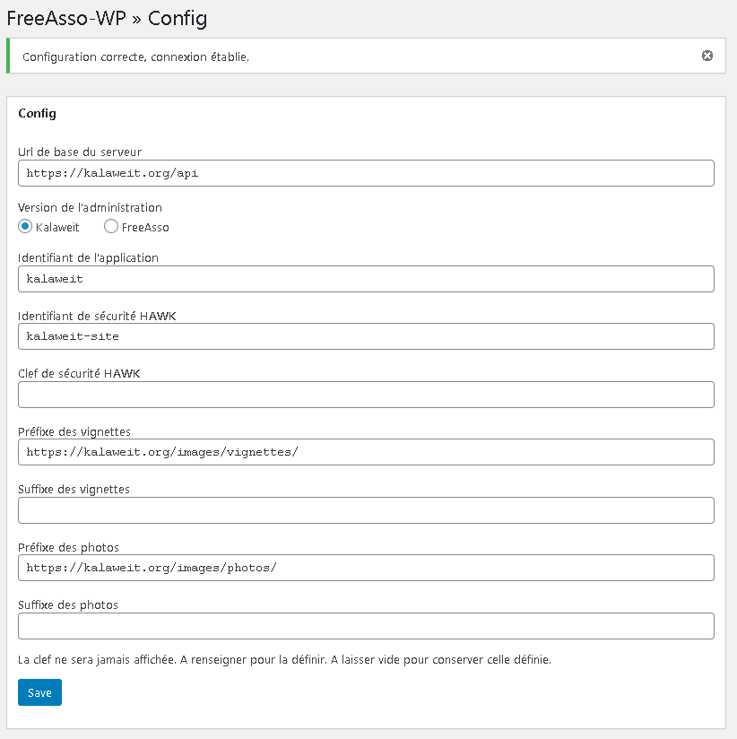

# FreeAsso wordpress plugin
---

Ce plugin permet de récupérer certains éléments de l'administration gérée par FreeAsso.

Il permet également de se connecter à l'administration Kalaweit.

Les documentations se trouvent dans le dossier doc :

* [Statistiques](./doc/stats.md)
* [Causes](./doc/causes.md)
* [Apis](./doc/apis.md)

## Paramétrage

Une fenêtre d'administration permet de paramétrer la connexion à l'administration.

Voici un exemple de configuration :

### Détail :

* Url de base du serveur :
    * https://administration.kalaweit.org/api pour l'administration Kalaweit
    * https://freeasso.org/api/v1/asso pour l'administration FreeAsso
* La version de l'administration
* Identifiant de l'application : kalaweit
* Identifiant de sécurité : kalaweit-site
* Clef de sécurité (ne sera jamais affichée)
    * Ce champ est à renseigner pour enregistrer une clef de sécurité
* Préfixe des vignettes :
    * https://images.kalaweit.org/images/vignettes/ pour l'administration kalaweit
    * https://freeasso.org/images/vignettes/ pour l'administration FreeAsso
* Suffixe des vignettes : non utilisé pour l'instant, servira pour préciser la taille de la vignette
* Préfixe des photos :
    * https://images.kalaweit.org/images/photos/ pour l'administration kalaweit
    * https://freeasso.org/images/photos/ pour l'administration FreeAsso
* Suffixe des photos : non utilisé pour l'instant

**Les informations sont sensibles à la casse**

## Technique

La sécurité de l'API est basée sur les spécifications HAWK, même si ces données sont affichées sur le site public.
D'autres appels seront développés, donc autant le prévoir tout de suite. Le plugin s'occupe de cette partie.

L'Api fonctionne en mode RESTful avec résultats en json.

Les vignettes et photos sont en cache côté serveur et actualisées lors de modifications.

Les données des filtres sont susceptibles de changer donc merci d'utiliser les APIs afin de récupérer leurs valeurs.

## Exemples

Une vue de recherche simplifiée existe.
Une vue complète paramétrable sera mise à disposition.
